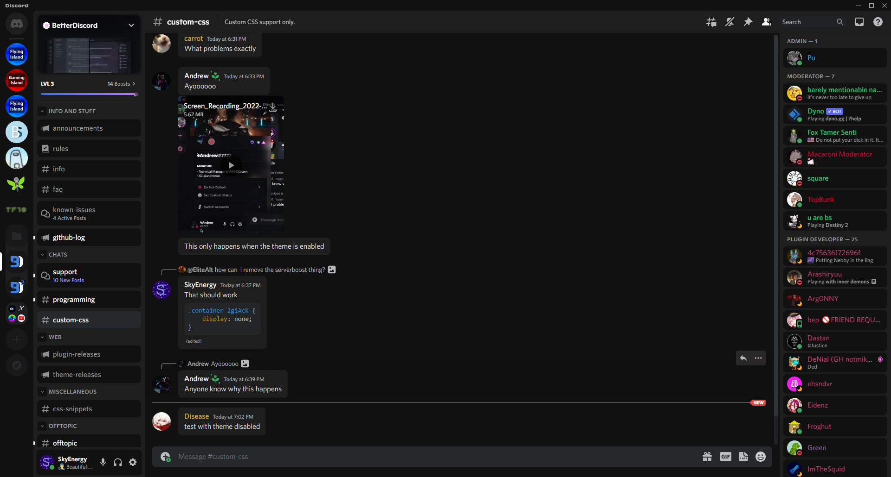

<!-- PROJECT LOGO -->
<br />
<div align="center">
  <a href="https://github.com/SkyEnergy0/Beautiful-Discord-Theme">
    
  </a>
  
  <h1 align="center">MK2 v1.6.2 (beta) | Beautiful Discord | Not Finished</h1>

  <p align="center">
    Made by a CSS NOOB but there's ❤️ in it
  </p>
</div>

<!-- ABOUT THE PROJECT -->
## Preview

<div align="center">
  <a href="https://cdn.discordapp.com/attachments/913890209224077382/1023278340653719683/unknown.png">
    
  </a>
</div>

## Installation

1. Download [BetterDiscord](https://betterdiscord.app)
2. Download [Beautiful Discord MK2 (beta)](https://github.com/SkyEnergy0/Beautiful-Discord-Theme/releases)
3. Install Theme go to
   ```
   C:\Users\your_username_\AppData\Roaming\BetterDiscord\themes
   ```
4. Paste the ```Beautiful-Discord-MK2.theme.css``` file into the themes folder

<!-- ROADMAP -->
## Roadmap

- ✅ MK2
- ⭕ Variables
- 🔧 Settings
- ✅ Forum
- ✅ User Popups Redesign

<!-- CONTACT -->
## Contact

 Discord - SkyEnergy#2948
