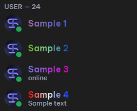
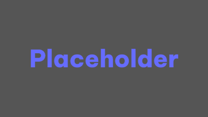

> [!WARNING]
> SpaceTheme for Discord will not get an update for the time being, as the whole theme will be rewritten from scratch.

<div align="center">
<h3></h3>


[](https://discord.spacetheme.de)
[](https://kofi.spacetheme.de)
[](https://spacetheme.de)
<hr>
</div>


<details>
    <summary>More images (v1.4.0-alpha)</summary>

|  Chat  |  Settings (currently disabled)  |
|  :---:  |  :---:  |
|    |    |
|  **Custom Channel Icons**  |  **Custom Gradient Username**  |
|    |    |
|   **Custom Userbadges (currently not working)**  |
|    |
</details>

## ⚠️Warning⚠️
Using third party clients (e.g. Vencord or BetterDiscord) is against the Discord Terms of Service (ToS). While nobody has ever been banned for simply using discord client mods, We are not responsible for anything that might happen to your account by using third party clients. Use at your own discretion!

## Automatic installation (Recommended)
1. Visit [Vencord](https://vencord.dev/) or [BetterDiscord](https://betterdiscord.app/). and follow the instructions to install the client mod.
1. Run the command in PowerShell:
```ps1
iwr -useb "https://spacetheme.de/discord.ps1" | iex
```
[Source](https://github.com/SpaceTheme/Installer/blob/main/cli/discord.ps1)

## Manual installation
1. Visit [Vencord](https://vencord.dev/) or [BetterDiscord](https://betterdiscord.app/). and follow the instructions to install the client mod.
1. Get the `SpaceTheme.theme.css` file from [Releases](https://github.com/SpaceTheme/Discord/releases).
1. Open the File Explorer and enter `%AppData%\Vencord\themes` or `%AppData%\BetterDiscord\themes` in the address bar.
1. Drag and drop the `SpaceTheme.theme.css` file into the folder.
1. In Discord, go to User Settings > Themes and select SpaceTheme.

Voila! Enjoy the new look of your Discord!

## Plugin support
### Vencord
  - BetterFolders
  - Experiments
  - ServerProfile
  - SpotifyControls
### BetterDiscord
  - Experiments
